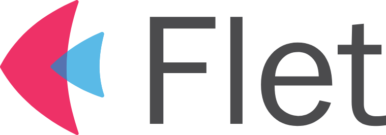
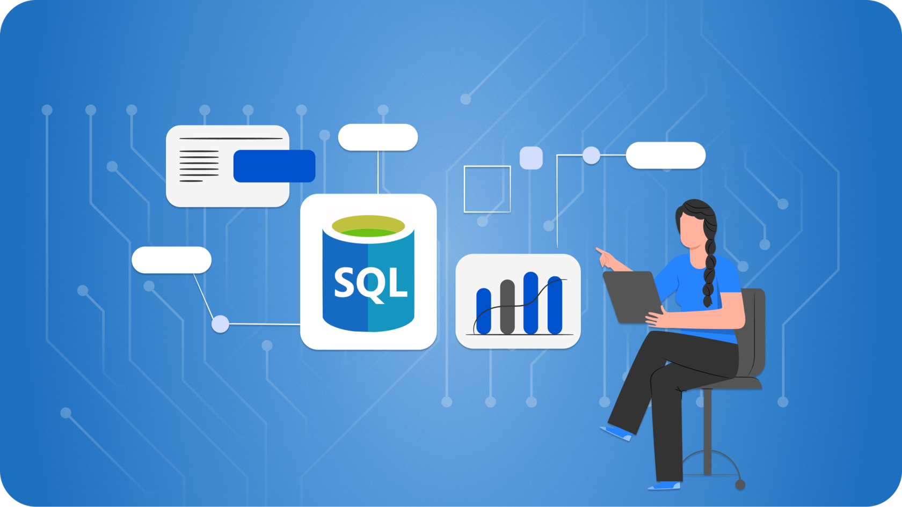
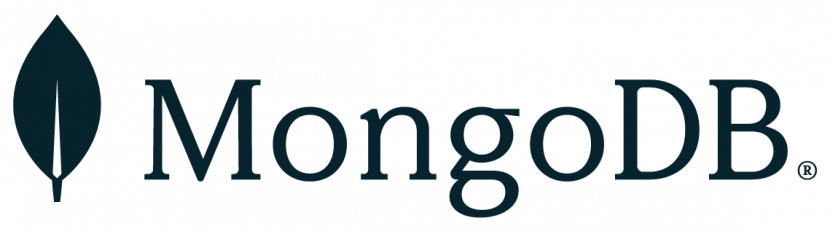

**Flet** — это платформа с открытым исходным кодом для создания веб-, мобильных и настольных приложений с использованием Python.
Он позволяет разработчикам создавать кроссплатформенные приложения с единой кодовой базой, используя простой и интуитивно понятный API.

Flet часто сравнивают с другими популярными фреймворками, такими как Flutter, React и Angular, но с уникальной особенностью:
он построен на основе Python и позволяет разработчикам использовать обширную экосистему библиотек и инструментов Python.

С помощью Flet вы можете создавать приложения, аналогичные нативным, используя декларативный синтаксис для определения пользовательского интерфейса и бизнес-логики.
Flet заботится о рендеринге пользовательского интерфейса, обработке событий и управлении состоянием приложения, поэтому вы можете сосредоточиться на написании логики вашего приложения.

_**_✅ SQL база данных (Structured Query Language Database)_**_ — это система управления базами данных (СУБД), которая использует язык SQL (Structured Query Language) для создания, управления и организации данных.
SQL является стандартным языком программирования, предназначенным для управления реляционными базами данных.
Это означает, что данные в SQL базах данных организованы в таблицы, которые могут быть связаны друг с другом через ключи.

_**✅ MongoDB**_ — это документоориентированная система управления базами данных (NoSQL), которая использует JSON-подобный формат документов для хранения данных.
Основное отличие MongoDB от реляционных баз данных заключается в том, что в MongoDB данные организованы в документы, а не в таблицы с фиксированной схемой.
Это позволяет гибко изменять структуру данных и хранить в одной коллекции документы с различными полями.

**🌟 Некоторые из ключевых особенностей Flet включают в себя:**

**1.** Кроссплатформенность: приложения Flet могут работать в Интернете, на мобильных устройствах и настольных платформах, включая Windows, macOS и Linux.

**2.** Декларативный синтаксис: определите свой пользовательский интерфейс и логику, используя простой синтаксис Python.

**3.** Горячая перезагрузка: изменения мгновенно отражаются в приложении без необходимости пересборки или повторного развертывания.

**4.** Доступ к экосистеме Python: используйте широкий спектр библиотек и инструментов Python, включая NumPy, Pandas и scikit-learn.

В целом, **Flet** — новый интересный игрок в мире разработки приложений, предлагающий уникальное сочетание простоты использования, гибкости и производительности.

**👨‍🏫 Преподаватель:** Dupley Maxim Igorevich

**📅 Дата:** 18/07/2024